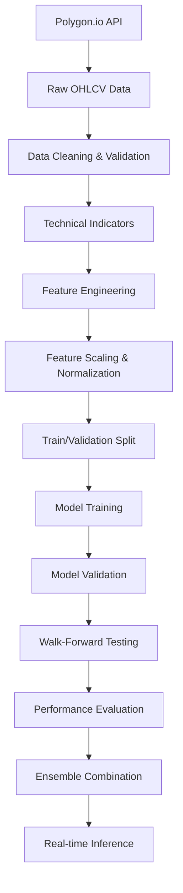
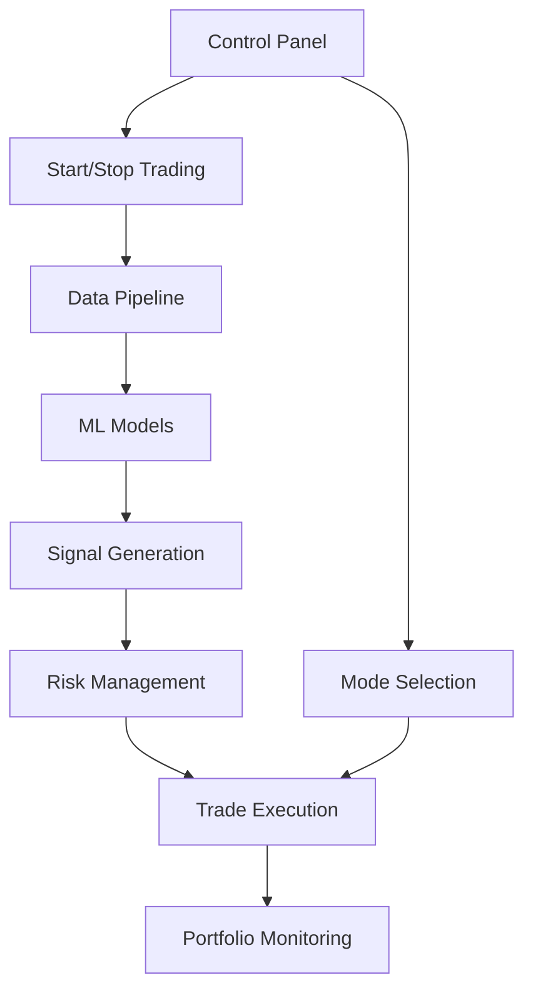
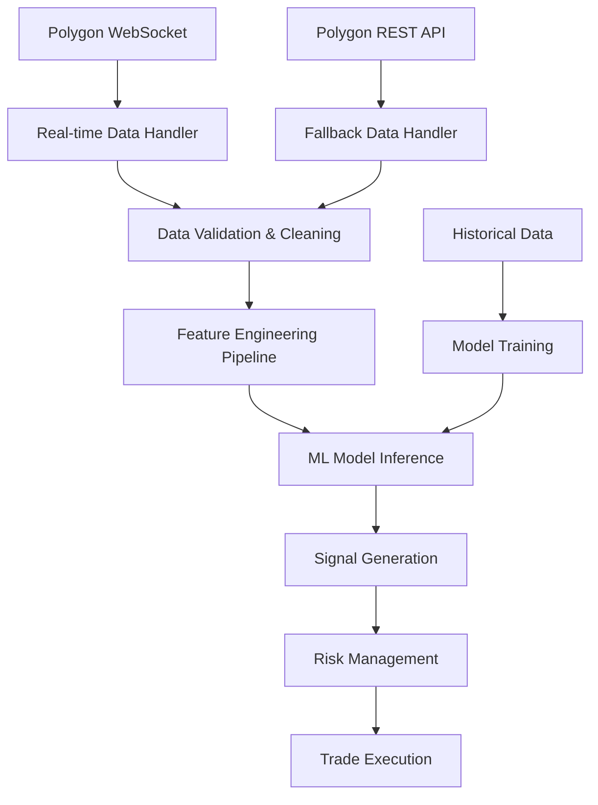

# Algorithmic Day Trading System - Product Requirements Document

## 1. Product Overview

A backend-focused algorithmic day trading system designed to run locally on Apple M4 hardware, leveraging advanced machine learning ensemble models for high-frequency trading with real-time market data processing and automated execution capabilities.

The system addresses the need for sophisticated, locally-deployable trading infrastructure that maximizes profit through ensemble modeling, real-time market regime detection, and dynamic portfolio optimization while maintaining minimal frontend overhead and focusing on core algorithmic functionality.

Target: Generate 30-60% annual returns with 2.0-3.5 Sharpe ratio through 150-300 daily trades across multiple market sectors with lightweight control interface.

## 2. Core Features

### 2.1 User Roles

| Role         | Registration Method  | Core Permissions                                                                            |
| ------------ | -------------------- | ------------------------------------------------------------------------------------------- |
| Default User | Direct system access | Full access to all trading functions, model training, backtesting, and portfolio management |

### 2.2 Feature Module

Our backend-focused algorithmic trading system consists of the following minimal pages:

1. **Control Panel**: Essential start/stop trading buttons, mode selection (paper/live), basic system status.
2. **Model Training**: ML model training triggers, ensemble management, basic performance metrics.
3. **Data Pipeline**: Real-time data feed monitoring, historical data status, feature pipeline controls.
4. **Trading Execution**: Position monitoring, basic P\&L display, manual override controls.

### 2.3 Development Approach: Back-to-Front Implementation

**Implementation Strategy:**
Build the system from end-to-start to ensure each component knows exactly what format and data it needs from the previous component.

**Development Sequence:**

1. **Trade Execution Engine** (Start Here)

   * Build Alpaca API integration for order placement

   * Define required signal format and position sizing inputs

   * Implement paper/live trading modes

2. **Signal Generation & Risk Management**

   * Build ensemble model prediction pipeline

   * Implement position sizing and risk checks

   * Define required feature format from ML models

3. **ML Model Training & Inference**

   * Train ensemble models (LSTM, CNN, RF, XGBoost, Transformer)

   * Define required feature engineering outputs

   * Implement real-time prediction pipeline

4. **Feature Engineering**

   * Build technical indicator calculations

   * Define required raw data format from data pipeline

   * Implement real-time feature computation

5. **Data Pipeline** (End Here)

   * Implement Polygon.io data ingestion

   * Build PostgreSQL storage layer

   * Ensure data format matches feature engineering requirements

### 2.4 Ticker and Sector Selection Strategy

**Selection Criteria for Day Trading:**

* **Volume Threshold**: Minimum 10M average daily volume for liquidity

* **Volatility Requirement**: Average True Range (ATR) > 2% for sufficient price movement

* **Beta Requirement**: Beta > 1.5 for higher volatility than market

* **Market Cap Range**: $1B - $100B for optimal liquidity/volatility balance

**Sector Focus (High Volatility Sectors):**

1. **Technology**: NVDA, TSLA, AAPL, MSFT, META (high beta, frequent catalysts)
2. **Biotechnology**: MRNA, GILD, BIIB, VRTX (FDA events, earnings volatility)
3. **Energy**: XOM, CVX, SLB, HAL (commodity price sensitivity)
4. **Crypto-Related**: MARA, COIN, RIOT (extreme volatility)
5. **Consumer Discretionary**: AMZN, NFLX, DIS (earnings-driven moves)

**Dynamic Selection Algorithm:**

* **Weekly Screening**: Scan for stocks meeting volume/volatility criteria

* **Sector Rotation**: Monitor sector relative strength using ETF performance

* **Market Regime Adaptation**: Adjust sector weights based on market conditions

* **Target Universe**: Maintain 50-100 actively traded stocks

**Implementation:**

```python
# Simple ticker selection logic
def select_trading_universe():
    criteria = {
        'min_volume': 10_000_000,
        'min_atr_pct': 2.0,
        'min_beta': 1.5,
        'market_cap_range': (1e9, 100e9)
    }
    # Screen stocks weekly, update trading universe
    return filtered_tickers
```

### 2.5 Page Details

| Page Name         | Module Name         | Feature description                                                       |
| ----------------- | ------------------- | ------------------------------------------------------------------------- |
| Control Panel     | Trading Engine      | Start/stop automated trading, emergency stop, mode selection (paper/live) |
| Control Panel     | System Status       | Basic data feed status, model health indicator, trading engine status     |
| Control Panel     | Portfolio Summary   | Current portfolio value, daily P\&L, active positions count               |
| Model Training    | Ensemble Management | Train ML models (LSTM, CNN, RF, XGBoost, Transformer), adjust weights     |
| Model Training    | Performance Monitor | Basic model accuracy metrics, recent performance tracking                 |
| Data Pipeline     | Feed Monitor        | Polygon.io connection status, real-time data quality checks               |
| Data Pipeline     | Historical Data     | Trigger historical data downloads, storage status                         |
| Data Pipeline     | Feature Engineering | Monitor technical indicator calculation, feature pipeline status          |
| Trading Execution | Position Monitor    | View current positions, manual position closure                           |
| Trading Execution | Risk Controls       | Basic position sizing, stop-loss monitoring, portfolio limits             |

## 3. ML Model Training Specifications

### 3.1 Training Data Requirements

**Historical Data Scope:**

* **Time Period**: Last 2 years of minute-level OHLCV data

* **Data Frequency**: 1-minute bars for all selected tickers

* **Training Window**: Rolling 18-month training, 6-month validation

* **Features**: 50+ technical indicators, market microstructure, sentiment data

**Data Preparation Pipeline:**



#### Walk-Forward Testing Framework

**Testing Methodology:**

* **Training Window**: 18 months of historical data

* **Testing Window**: 1 month out-of-sample validation

* **Rolling Period**: Advance by 1 week, retrain models

* **Validation Cycles**: 50+ iterations for statistical significance

* **Performance Threshold**: Models must achieve >1.5 Sharpe ratio to proceed to ensemble

**Walk-Forward Process:**

1. Train models on 18-month window
2. Test on next 1-month period
3. Calculate performance metrics (returns, Sharpe, drawdown)
4. Advance window by 1 week
5. Repeat process across 2-year dataset
6. Select best-performing models for ensemble
7. Optimize ensemble weights based on walk-forward results

**Performance Validation:**

* Minimum 52% win rate required

* Maximum 15% drawdown threshold

* Consistent performance across different market regimes

* Risk-adjusted returns must exceed benchmark

### 3.2 Individual Model Training Specifications

**1. LSTM (Long Short-Term Memory) Networks**

* **Purpose**: Capture sequential dependencies in price movements

* **Architecture**: 3-layer LSTM with 128, 64, 32 units

* **Input**: 60-minute lookback window of normalized features

* **Output**: Next 1-minute price direction probability

* **Training**:

  * Batch size: 256

  * Epochs: 100 with early stopping

  * Optimizer: Adam (lr=0.001)

  * Loss: Binary crossentropy

  * Validation: Walk-forward on last 6 months

**2. CNN (Convolutional Neural Networks)**

* **Purpose**: Detect local patterns in price and volume data

* **Architecture**: 2D CNN treating time-series as images

* **Input**: 30x20 matrix (30 minutes × 20 features)

* **Layers**: Conv2D(32) → Conv2D(64) → Dense(50) → Dense(1)

* **Training**:

  * Batch size: 128

  * Epochs: 80

  * Optimizer: RMSprop (lr=0.0005)

  * Regularization: Dropout(0.3), L2(0.01)

**3. Random Forest**

* **Purpose**: Capture non-linear feature interactions

* **Parameters**: 200 trees, max\_depth=15, min\_samples\_split=10

* **Features**: All 50+ engineered features

* **Training**: Parallel processing using all CPU cores

* **Validation**: Out-of-bag scoring + time-series CV

**4. XGBoost**

* **Purpose**: Gradient boosting for complex pattern recognition

* **Parameters**: 500 estimators, learning\_rate=0.1, max\_depth=8

* **Features**: Feature importance-based selection (top 30)

* **Training**: GPU acceleration if available

* **Hyperparameter Tuning**: Bayesian optimization

**5. Transformer Models**

* **Purpose**: Attention mechanisms for long-range dependencies

* **Architecture**: 4-head attention, 2 encoder layers

* **Input**: 120-minute sequence with positional encoding

* **Training**: Warmup learning rate schedule

* **Memory**: Optimized for real-time inference

### 3.3 Ensemble Training Strategy

**Dynamic Weight Optimization:**

* **Method**: Bayesian optimization for ensemble weights

* **Objective**: Maximize Sharpe ratio on validation set

* **Rebalancing**: Weekly weight updates based on recent performance

* **Constraints**: No single model > 40% weight

**Real-time Adaptation:**

* **Online Learning**: Incremental updates every 1000 minutes

* **Concept Drift Detection**: Monitor prediction accuracy degradation

* **Model Refresh**: Retrain models monthly with new data

## 4. Core Process

**Backend-Focused Operation Flow:**
Minimal user interaction with emphasis on automated backend processes for data, models, and trading execution.

**System Setup Flow:**

1. Configure API credentials and database connections
2. Initialize historical data pipeline and feature engineering
3. Train ensemble ML models with automated optimization
4. Validate models through backtesting
5. Deploy for paper/live trading with minimal controls

**Automated Trading Flow:**

1. System automatically processes real-time data feeds
2. ML models generate trading signals
3. Risk management and position sizing algorithms execute
4. Automated trade execution with minimal user intervention
5. Background performance monitoring



## 4. User Interface Design

### 4.1 Design Style

* **Primary Colors**: Minimal dark theme with #1a1a1a background, #00ff88 for profits, #ff4444 for losses

* **Secondary Colors**: #333333 for panels, #666666 for borders, #ffffff for text

* **Button Style**: Simple rectangular buttons with clear labels, minimal styling overhead

* **Font**: System default fonts, 14px base size, monospace for numerical data only

* **Layout Style**: Basic grid layout with essential controls, no complex dashboard components

* **Icons**: Minimal use of icons, text-based labels preferred for clarity

### 4.2 Page Design Overview

| Page Name         | Module Name         | UI Elements                                                      |
| ----------------- | ------------------- | ---------------------------------------------------------------- |
| Control Panel     | Trading Engine      | Large start/stop buttons, simple mode toggle, basic status text  |
| Control Panel     | Portfolio Summary   | Plain text display of key metrics, minimal formatting            |
| Model Training    | Ensemble Management | Basic form inputs, simple progress indicators, text-based status |
| Data Pipeline     | Feed Monitor        | Simple status indicators, basic connection status text           |
| Trading Execution | Position Monitor    | Plain table layout, essential data only, minimal styling         |

### 4.3 Responsiveness

Desktop-only design focused on functionality over aesthetics. No mobile responsiveness required as this is a backend-focused trading system for dedicated hardware.

### 4.4 Deployment Architecture (V1 Simplified)

**Local Development Focus:**

* Native Python execution on macOS (no Docker overhead)

* Direct PostgreSQL connection (local installation)

* In-memory caching instead of Redis for simplicity

* Single-process architecture with threading for parallel tasks

* Simplified dependency management with pip/conda

* Configuration via simple JSON/YAML files

* Python logging module with file rotation for audit trails

## 5. Technical Specifications

### 5.1 Technology Stack (V1 Simplified)

* **Backend**: Python 3.11+ with FastAPI for API endpoints

* **Database**: PostgreSQL with time-series optimizations (port 5433)

* **Caching**: In-memory Python dictionaries and pandas DataFrames for real-time features

* **ML Framework**: TensorFlow/PyTorch for deep learning, scikit-learn for traditional ML, XGBoost for gradient boosting

* **Data APIs**: polygon-api-client for market data (REST + WebSocket), alpaca-py for trading execution

* **Frontend**: Minimal web interface with HTML/CSS/JavaScript for basic controls

* **Parallel Processing**: Native Python multiprocessing for M4 chip optimization, asyncio for concurrent data processing

* **Deployment**: Native Python processes (no Docker containerization for V1)

### 5.2 Real-Time Data Streaming

**Polygon WebSocket Integration:**

* **Primary Data Source**: Polygon.io WebSocket for real-time market data streaming

* **Data Types**: Live trades, quotes, minute aggregates for all trading universe symbols

* **Connection Management**: Automatic reconnection, heartbeat monitoring, error handling

* **Authentication**: API key-based authentication with secure connection

* **Rate Limiting**: Respect Polygon's WebSocket rate limits and subscription tiers

* **Fallback Strategy**: REST API fallback for WebSocket connection failures

**WebSocket Implementation:**

```python
from polygon import WebSocketClient

# Initialize WebSocket client
ws_client = WebSocketClient(
    api_key="your_polygon_api_key",
    market="stocks",
    feed="delayed"  # or "real-time" for live trading
)

# Subscribe to real-time data
ws_client.subscribe_trades("AAPL", "TSLA", "NVDA")
ws_client.subscribe_quotes("AAPL", "TSLA", "NVDA")
ws_client.subscribe_minute_aggregates("AAPL", "TSLA", "NVDA")

# Handle real-time data
def handle_trade(trade):
    # Process live trade data
    pass

def handle_quote(quote):
    # Process live quote data
    pass

ws_client.run(handle_trade=handle_trade, handle_quote=handle_quote)
```

**Data Flow Architecture:**



**Performance Requirements:**

* **Latency**: <50ms from WebSocket data receipt to signal generation

* **Throughput**: Handle 1000+ messages per second across all subscribed symbols

* **Reliability**: 99.9% uptime with automatic reconnection

* **Data Quality**: Real-time validation and anomaly detection

### 5.3 API Credentials Configuration

**Environment Variables (.env file):**

```bash
# POLYGON.IO API CONFIGURATION
POLYGON_API_KEY="CNGpuywBPUXpXnLPrlJcqpcMq2sGe4Hl"

# ALPACA TRADING API CONFIGURATION
# Paper Trading
ALPACA_PAPER_API_KEY="PKJ3S1HJKK1761DD6RMB"
ALPACA_PAPER_SECRET_KEY="3PYOI8DxhMPFTLI2RBFHqDf1ZgiVfSY09DeTGmr3"
ALPACA_PAPER_BASE_URL="https://paper-api.alpaca.markets/v2"

# Live Trading
ALPACA_LIVE_API_KEY="AKSFPBJ6DGZEZWQKKRC7"
ALPACA_LIVE_SECRET_KEY="oguJlLqFmBnUKIMgg9PWtLmnvUYmAzjdZkXqxxKk"
ALPACA_LIVE_BASE_URL="https://api.alpaca.markets"

# DATABASE CONFIGURATION
DATABASE_HOST="localhost"
DATABASE_PORT="5433"
DATABASE_NAME="algo_trading_db"
DATABASE_USER="trading_user"
DATABASE_PASSWORD="your_secure_password"

# TRADING CONFIGURATION
TRADING_MODE="paper"  # Options: "paper" or "live"
```

### 5.3 Hardware Optimization

* **Memory Usage**: Leverage 32GB RAM for in-memory feature caching and model ensembles

* **CPU Utilization**: Parallel model training across M4 performance cores

* **Storage**: SSD optimization for fast historical data retrieval

* **Network**: Concurrent API connections for real-time data and trading

**V1 Architecture Simplification Rationale:**

* **No Docker**: Single-user local system doesn't need containerization overhead

* **No Redis**: 32GB RAM allows efficient in-memory caching with Python data structures

* **Direct PostgreSQL**: Eliminates network overhead and connection pooling complexity

* **Native Python**: Faster development iteration and debugging without container layers

* **Simplified Deployment**: Direct pip install and Python execution for rapid prototyping

### 5.4 Security & Credentials

* **Environment Variables**: Store all API keys and secrets in .env file located in `/Users/anthonyxiao/Dev/hunter_x_hunter_day_trade_v3/backend/` folder

* **API Rate Limiting**: Implement proper rate limiting for Polygon.io and Alpaca APIs

* **Data Encryption**: Encrypt sensitive trading data and credentials

* **Audit Logging**: Comprehensive logging of all trading decisions and executions

**API Configuration Example:**

```json
{
  "polygon": {
    "api_key": "your_polygon_api_key"
  },
  "alpaca": {
    "paper": {
      "api_key": "your_paper_api_key",
      "secret_key": "your_paper_secret_key",
      "base_url": "https://paper-api.alpaca.markets/v2"
    },
    "live": {
      "api_key": "your_live_api_key",
      "secret_key": "your_live_secret_key",
      "base_url": "https://api.alpaca.markets"
    }
  },
  "database": {
    "host": "localhost",
    "port": 5433,
    "database": "trading_system",
    "user": "trader",
    "password": "secure_password"
  }
}
```

### 5.5 Performance Targets

* **Latency**: <100ms from signal generation to order placement

* **Throughput**: Handle 200-400 trades per day across 50-100 stocks

* **Uptime**: 99.9% availability during market hours

* **Data Processing**: Real-time processing of minute-level data for entire stock universe

### 5.6 Risk Controls

* **Position Limits**: Maximum 5% per stock, 25% per sector

* **Loss Limits**: 2% daily portfolio loss limit with automatic shutdown

* **Model Validation**: Continuous out-of-sample performance monitoring

* **Market Regime Adaptation**: Dynamic strategy adjustment based on volatility and correlation patterns

### 5.7 Hybrid Feature Storage Strategy

**Implementation Approach:**
The system implements a hybrid storage strategy for engineered features and technical indicators to optimize both persistence and real-time performance:

#### A. Feature Existence Check

* **Added check\_existing\_features() method** to query which timestamps already have features

* **Before engineering features**, the system now checks what's already stored

* **Only processes missing time periods** instead of the entire dataset

* **Coverage threshold**: Skip feature engineering if >95% coverage exists

* **Smart training flow**: Automatically loads existing features when sufficient coverage is available

* **Performance benefit**: Reduces computation time by avoiding redundant feature generation

* **Logging enhancement**: Detailed logs showing feature coverage percentages and skipped vs. newly generated features

**1. PostgreSQL Storage (Persistence Layer):**

* **Purpose**: Long-term storage of all computed features with timestamps

* **Schema**: JSONB storage for flexible feature schemas with time-series optimizations

* **Indexing**: Optimized indexes on (symbol, timestamp) for millisecond lookups

* **Partitioning**: Time-series partitioning for fast historical queries

* **Benefits**: Data persistence, historical analysis, model training consistency

**2. In-Memory Caching (Performance Layer):**

* **Purpose**: Ultra-low latency access to recent features (last 2 hours)

* **Implementation**: Python dictionaries with automatic cache management

* **Cache Size**: Maximum 10,000 feature records per symbol

* **Cleanup**: Automatic removal of old entries beyond 2-hour window

* **Benefits**: Sub-millisecond feature lookup for real-time trading

**3. Real-Time Updates (Streaming Layer):**

* **Process**: Stream new features to both PostgreSQL and in-memory cache simultaneously

* **Consistency**: Ensure data consistency between storage layers

* **Error Handling**: Graceful degradation if one storage layer fails

* **Monitoring**: Track storage performance and cache hit rates

**Database Optimizations:**

```sql
-- Time-series optimized features table
CREATE TABLE features (
    id SERIAL PRIMARY KEY,
    symbol VARCHAR(10) NOT NULL,
    timestamp TIMESTAMP NOT NULL,
    features JSONB NOT NULL,
    created_at TIMESTAMP DEFAULT CURRENT_TIMESTAMP,
    UNIQUE(symbol, timestamp)
);

-- Optimized indexes for hybrid storage
CREATE INDEX idx_features_symbol_timestamp ON features(symbol, timestamp DESC);
CREATE INDEX idx_features_jsonb ON features USING GIN (features);
CREATE INDEX idx_features_recent ON features(symbol, timestamp DESC) 
WHERE timestamp >= CURRENT_TIMESTAMP - INTERVAL '7 days';
```

**Resource Utilization:**

* **Storage Requirements**: \~1GB/month for 100 stocks with 50+ features

* **Memory Usage**: Leverage M4's 32GB RAM for intelligent caching

* **Cache Performance**: <1ms feature lookup for recent data

* **Database Performance**: <10ms for historical feature queries

* **Scalability**: Supports 100+ symbols with real-time feature updates

**Performance Benefits:**

* **Real-Time Trading**: Instant feature access for high-frequency decisions

* **Model Training**: Fast historical data retrieval for backtesting

* **System Reliability**: Persistent storage with in-memory performance

* **Audit Trail**: Complete feature history for compliance and analysis

**Implementation Details:**

* **Feature Engineering Pipeline**: Automatically stores features during computation

* **Cache Management**: Intelligent cleanup based on time and size limits

* **Failover Strategy**: Database fallback if cache misses occur

* **Monitoring**: Real-time metrics on storage performance and cache efficiency

This hybrid approach ensures the system meets latency requirements for day trading while maintaining data integrity and supporting comprehensive historical analysis for model improvement.

This system represents a comprehensive approach to algorithmic trading, combining cutting-edge machine learning with robust risk management and real-time execution capabilities, specifically optimized for local deployment on Apple M4 hardware.
