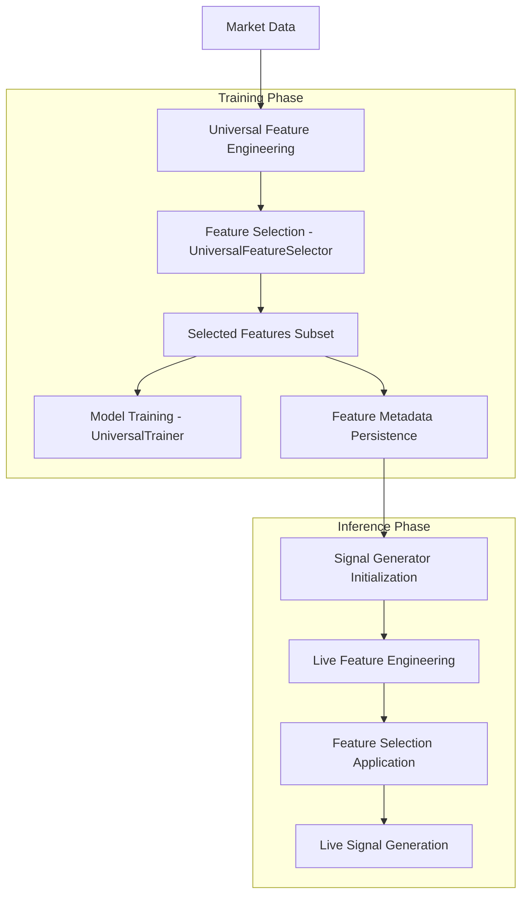

# Feature Selection Integration Analysis

## Overview
This document analyzes how `universal_trainer.py` and `signal_generator.py` utilize `feature_selector.py` to ensure consistent feature usage between model training and live signal generation.

## 1. Feature Selection Integration in Universal Trainer

### 1.1 Core Integration Points

#### Feature Selector Initialization
```python
# In UniversalTrainer.__init__()
from .feature_selector import UniversalFeatureSelector, FeatureSelectionConfig

# Initialize feature selector
self.feature_selector = None
self.selected_features = None
```

#### Feature Selection Before Training
The universal trainer integrates feature selection through several key methods:

**Method: `_prepare_training_data()`** (Referenced in training pipeline)
- Performs feature selection before model training begins
- Ensures only selected features are used for training
- Validates feature dimensions match model requirements

**Method: `_validate_feature_dimensions()`** (Lines 262-400)
- Comprehensive feature validation ensuring consistent dimensions
- Validates feature counts match expected totals (262 features)
- Categorizes features into technical, cross-symbol, market regime, and symbol embeddings
- Logs detailed feature breakdowns for debugging

```python
def _validate_feature_dimensions(self, features_df: pd.DataFrame, context: str, expected_total: int = 262) -> bool:
    # Analyzes feature types and validates counts
    # Ensures consistency across training phases
```

### 1.2 Feature Selection Workflow

1. **Feature Engineering**: Universal feature engineering creates comprehensive feature set
2. **Feature Selection**: `UniversalFeatureSelector` reduces features to optimal subset
3. **Validation**: Feature dimensions validated before training
4. **Training**: Models trained exclusively on selected features
5. **Persistence**: Selected features saved to metadata for inference

### 1.3 Feature Persistence Mechanism

**Metadata Storage**:
- Selected features stored in `universal_metadata.json`
- Feature selection metadata includes:
  - Selected feature list
  - Selection method used
  - Performance metrics
  - Category distribution

```python
# Feature metadata structure
{
    "selected_features": ["feature1", "feature2", ...],
    "feature_selection": {
        "method": "mutual_info",
        "target_count": 65,
        "performance_metrics": {...}
    }
}
```

## 2. Feature Selection Usage in Signal Generator

### 2.1 Feature Selection Loading

#### Initialization Integration
```python
# In SignalGenerator.__init__()
from ml.feature_selector import UniversalFeatureSelector, FeatureSelectionConfig

# Feature selection components
self.feature_selector: Optional[UniversalFeatureSelector] = None
self.selected_features: Optional[List[str]] = None
self.feature_selection_metadata: Dict[str, Any] = {}
```

#### Feature Loading Method
**Method: `load_feature_selection_results()`** (Lines 400-450)
- Loads selected features from training metadata
- Attempts universal metadata first, falls back to training metadata
- Ensures inference uses identical feature set as training

```python
async def load_feature_selection_results(self) -> bool:
    # Load from universal metadata
    if universal_metadata_file.exists():
        with open(universal_metadata_file, 'r') as f:
            metadata = json.load(f)
        
        if 'selected_features' in metadata:
            self.selected_features = metadata['selected_features']
            self.feature_selection_metadata = metadata.get('feature_selection', {})
            return True
```

### 2.2 Live Signal Generation with Selected Features

#### Feature Application During Inference
**Method: `_prepare_features_for_prediction()`** (Referenced in prediction pipeline)
- Applies feature selection to live market data
- Ensures only selected features are used for prediction
- Validates feature consistency with training data

#### Universal Feature Engineering Integration
```python
# Universal feature engineering for live data
self.universal_feature_engineering: Optional[UniversalFeatureEngineering] = None

# Feature consistency validation
if self.selected_features:
    # Apply feature selection to live features
    live_features = live_features[self.selected_features]
```

### 2.3 Feature Consistency Validation

#### Validation Mechanisms
1. **Feature Count Validation**: Ensures live features match training feature count
2. **Feature Name Validation**: Verifies exact feature names match training set
3. **Feature Order Validation**: Maintains consistent feature ordering
4. **Missing Feature Handling**: Handles missing features gracefully

## 3. Data Flow and Consistency Mechanisms

### 3.1 Complete Data Flow



### 3.2 Consistency Enforcement Points

#### 1. Feature Selection Configuration
```python
# FeatureSelectionConfig ensures consistent parameters
class FeatureSelectionConfig:
    target_feature_count: int = 65
    selection_method: str = "mutual_info"
    # Consistent configuration across training and inference
```

#### 2. Metadata-Based Communication
- **Training Phase**: Saves selected features to `universal_metadata.json`
- **Inference Phase**: Loads identical feature list from metadata
- **Validation**: Ensures feature consistency through validation checks

#### 3. Feature Engineering Consistency
```python
# Both components use UniversalFeatureEngineering
# Training: universal_trainer.py
self.feature_engineering = UniversalFeatureEngineering()

# Inference: signal_generator.py
self.universal_feature_engineering = UniversalFeatureEngineering()
```

### 3.3 Key Integration Functions

#### Universal Trainer Functions
1. **`_validate_feature_dimensions()`**: Validates feature consistency
2. **`_prepare_training_data()`**: Applies feature selection before training
3. **`_save_training_metadata()`**: Persists selected features

#### Signal Generator Functions
1. **`load_feature_selection_results()`**: Loads selected features
2. **`_prepare_features_for_prediction()`**: Applies feature selection to live data
3. **`_validate_feature_consistency()`**: Ensures training-inference consistency

### 3.4 Consistency Validation Mechanisms

#### Training-Time Validation
- Feature count validation against expected dimensions
- Feature category distribution validation
- Model architecture compatibility checks

#### Inference-Time Validation
- Selected feature availability in live data
- Feature count consistency with training
- Feature name and order validation

## 4. Critical Integration Points

### 4.1 Feature Selection Chain
1. **Universal Feature Engineering** → Creates comprehensive feature set
2. **Feature Selection** → Reduces to optimal subset (65 features)
3. **Training** → Models trained on selected features only
4. **Persistence** → Selected features saved to metadata
5. **Inference** → Live signals use identical feature subset

### 4.2 Consistency Guarantees

#### Metadata-Driven Consistency
- Single source of truth for selected features
- Atomic updates ensure consistency
- Version tracking prevents mismatches

#### Validation-Enforced Consistency
- Pre-training feature validation
- Pre-inference feature validation
- Runtime consistency checks

### 4.3 Error Handling and Fallbacks

#### Missing Feature Selection
```python
if not self.selected_features:
    logger.warning("No feature selection results found, using all features")
    # Fallback to all engineered features
```

#### Feature Mismatch Handling
- Graceful degradation when features are missing
- Logging and alerting for consistency violations
- Automatic feature alignment when possible

## 5. Benefits of This Integration

### 5.1 Model Performance
- **Reduced Overfitting**: Fewer features reduce model complexity
- **Improved Generalization**: Selected features are most predictive
- **Faster Training**: Reduced dimensionality speeds training

### 5.2 System Reliability
- **Consistency Guarantee**: Training and inference use identical features
- **Validation Safety**: Multiple validation layers prevent errors
- **Maintainability**: Centralized feature selection logic

### 5.3 Operational Benefits
- **Faster Inference**: Fewer features mean faster predictions
- **Reduced Memory**: Lower memory footprint for live systems
- **Better Monitoring**: Clear feature lineage and validation

## Conclusion

The integration between `universal_trainer.py`, `signal_generator.py`, and `feature_selector.py` ensures robust consistency between model training and live signal generation through:

1. **Centralized Feature Selection**: `UniversalFeatureSelector` provides consistent feature selection logic
2. **Metadata-Driven Communication**: Selected features persisted and loaded via metadata files
3. **Multi-Layer Validation**: Feature consistency validated at multiple points
4. **Unified Feature Engineering**: Both components use `UniversalFeatureEngineering` for consistency

This architecture guarantees that models are trained and deployed with identical feature sets, ensuring reliable and consistent trading signal generation.