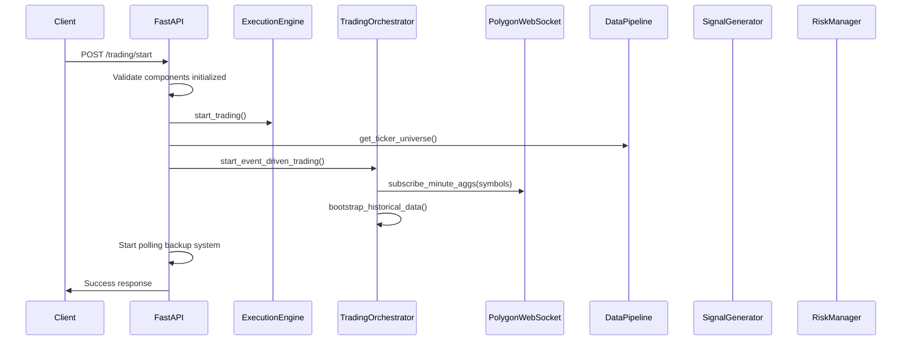
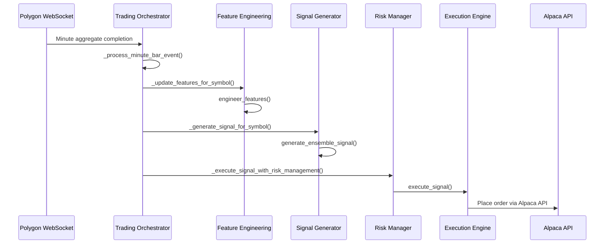
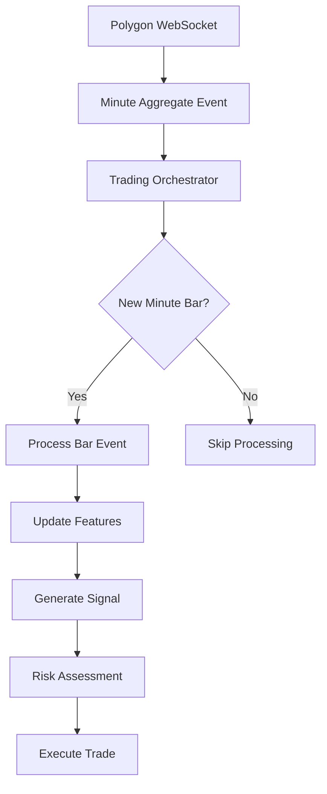

# Trading Start Endpoint Analysis

## 1. Endpoint Overview

**Endpoint:** `POST /trading/start`  
**Location:** `/Users/anthonyxiao/Dev/hunter_x_hunter_day_trade_v3/backend/main.py:447`  
**Purpose:** Initiates the algorithmic trading system with event-driven orchestration and real-time data processing

## 2. Complete Request Flow

### 2.1 Initial Request Processing



### 2.2 Event-Driven Data Flow (Real-time Trading)



## 3. Key Files and Components

### 3.1 Core Application Files

| File | Purpose | Key Functions |
|------|---------|---------------|
| `main.py` | FastAPI application entry point | `start_trading()`, `initialize_trading_system()` |
| `trading/trading_orchestrator.py` | Event-driven trading coordination | `start()`, `_on_minute_aggregate()`, `_process_minute_bar_event()` |
| `trading/execution_engine.py` | Trade execution and order management | `execute_signal()`, `start_trading()`, `place_order()` |
| `trading/signal_generator.py` | ML-based signal generation | `generate_signals()`, `generate_ensemble_signal()` |
| `trading/risk_manager.py` | Risk assessment and position sizing | `calculate_position_size()`, `assess_risk()` |
| `data/polygon_websocket.py` | Real-time data streaming | `subscribe_minute_aggs()`, `_handle_agg()` |
| `data/data_pipeline.py` | Data processing and storage | `store_market_data()`, `bootstrap_feature_cache()` |
| `ml/ml_feature_engineering.py` | Feature calculation and caching | `engineer_features()`, `calculate_technical_indicators()` |

### 3.2 ML Model Files

| Component | Location | Purpose |
|-----------|----------|----------|
| Model Trainer | `ml/model_trainer.py` | Train ensemble models (LSTM, CNN, Transformer, RF, XGBoost) |
| Universal Trainer | `ml/universal_trainer.py` | Universal model architecture training |
| Model Architectures | `ml/universal_model_architectures.py` | Define neural network architectures |
| Feature Engineering | `ml/universal_feature_engineering.py` | Advanced feature calculation |

## 4. Key Functions Execution Flow

### 4.1 Endpoint Handler Function

**Function:** `start_trading()` in `main.py:447`

```python
@app.post("/trading/start")
async def start_trading(background_tasks: BackgroundTasks):
    # 1. Validate system state
    # 2. Start execution engine
    # 3. Get trading symbols
    # 4. Start event-driven trading
    # 5. Start polling backup
    # 6. Return success response
```

### 4.2 Event-Driven Trading Initialization

**Function:** `start_event_driven_trading()` in `trading_orchestrator.py`

1. **Data Bootstrapping:** `_bootstrap_historical_data()`
   - Downloads historical data for cold start
   - Generates initial feature cache
   - Ensures sufficient data for ML models

2. **WebSocket Subscription:** `subscribe_minute_aggs()`
   - Subscribes to Polygon minute aggregates
   - Registers event handlers
   - Establishes real-time data stream

3. **Background Tasks:**
   - End-of-day liquidation scheduler
   - Polling backup system
   - Performance monitoring

### 4.3 Real-time Trading Loop

**Trigger:** Polygon WebSocket minute aggregate completion

**Handler:** `_on_minute_aggregate()` → `_process_minute_bar_event()`

**Processing Steps:**
1. **Feature Update:** `_update_features_for_symbol()`
   - Calculate technical indicators
   - Update feature cache
   - Store in database

2. **Signal Generation:** `_generate_signal_for_symbol()`
   - Load ensemble models
   - Generate predictions
   - Calculate confidence scores

3. **Risk Management:** `_execute_signal_with_risk_management()`
   - Position sizing calculation
   - Risk assessment
   - Portfolio exposure checks

4. **Trade Execution:** `execute_signal()`
   - Order placement via Alpaca API
   - Order tracking
   - Performance logging

## 5. Dependencies and External Services

### 5.1 External APIs

| Service | Purpose | Authentication | Rate Limits |
|---------|---------|----------------|-------------|
| **Polygon.io WebSocket** | Real-time market data | API Key | 1000 concurrent connections |
| **Polygon.io REST API** | Historical data | API Key | 5 requests/minute (free tier) |
| **Alpaca Trading API** | Order execution | API Key + Secret | 200 requests/minute |
| **Supabase** | Data storage | Service Key | 500 requests/second |

### 5.2 Internal Dependencies

| Component | Dependencies | Purpose |
|-----------|--------------|----------|
| **TensorFlow/Keras** | Neural network models | LSTM, CNN, Transformer models |
| **scikit-learn** | Traditional ML models | Random Forest, preprocessing |
| **XGBoost** | Gradient boosting | XGBoost ensemble model |
| **pandas/numpy** | Data processing | Feature engineering, calculations |
| **TA-Lib** | Technical analysis | Technical indicators |
| **asyncio** | Async processing | Concurrent operations |

## 6. Data Flow: Polygon WebSocket to Trade Execution

### 6.1 Real-time Data Ingestion



### 6.2 Feature Engineering Pipeline

**Input:** OHLCV + VWAP + Transactions data from Polygon

**Processing:**
1. **Technical Indicators:** RSI, MACD, Bollinger Bands, Moving Averages
2. **Market Microstructure:** VWAP ratios, transaction patterns
3. **Cross-Asset Features:** Correlation analysis, sector momentum
4. **Sentiment Features:** Market regime detection
5. **Engineered Features:** Custom mathematical transformations

**Output:** 50+ feature vector for ML models

### 6.3 ML Signal Generation

**Ensemble Models:**
- **LSTM:** Sequential pattern recognition
- **CNN:** Local pattern detection
- **Transformer:** Attention-based analysis
- **Random Forest:** Non-linear relationships
- **XGBoost:** Gradient boosting

**Ensemble Weighting:** Optimized weights based on historical performance

**Signal Output:**
- Action: BUY/SELL/HOLD/CLOSE
- Confidence: 0.0-1.0
- Predicted Return: Expected percentage return
- Risk Score: Risk assessment

### 6.4 Risk Management and Execution

**Risk Checks:**
- Position size limits (2% per position)
- Daily loss limits (3% max)
- Portfolio exposure (10% max risk)
- Correlation limits (0.7 max)
- Liquidity requirements ($1M min volume)

**Order Execution:**
- Market orders for immediate execution
- Stop-loss orders (2% default)
- Take-profit orders (4% default)
- Position tracking and monitoring

## 7. Critical Paths and Performance

### 7.1 Critical Performance Paths

1. **WebSocket Event Processing:** <500ms target
   - Feature calculation: ~200ms
   - ML inference: ~150ms
   - Risk assessment: ~50ms
   - Order placement: ~100ms

2. **Data Bootstrap (Cold Start):** ~30-60 seconds
   - Historical data download
   - Feature cache population
   - Model initialization

3. **Model Loading:** ~5-10 seconds per symbol
   - TensorFlow model loading
   - Scaler initialization
   - Ensemble weight loading

### 7.2 Potential Bottlenecks

| Component | Bottleneck | Mitigation |
|-----------|------------|------------|
| **Feature Engineering** | Complex calculations | Caching, parallel processing |
| **ML Inference** | Model prediction time | Model optimization, batch processing |
| **Database Operations** | Supabase rate limits | Batching, connection pooling |
| **WebSocket Processing** | Event queue backup | Async processing, locks |
| **API Rate Limits** | Polygon/Alpaca limits | Request throttling, caching |

### 7.3 Scalability Considerations

- **Horizontal Scaling:** Multiple instances with symbol partitioning
- **Caching Strategy:** Redis for feature caching
- **Database Optimization:** Indexed queries, batch operations
- **Model Optimization:** Quantization, pruning for faster inference

## 8. Security Implications

### 8.1 API Security

| Risk | Mitigation | Implementation |
|------|------------|----------------|
| **API Key Exposure** | Environment variables | `config.py` settings |
| **Unauthorized Access** | CORS middleware | FastAPI CORS configuration |
| **Rate Limit Abuse** | Request throttling | Built-in rate limiting |
| **Data Injection** | Input validation | Pydantic models |

### 8.2 Trading Security

- **Paper Trading Mode:** Default safe mode for testing
- **Position Limits:** Hard-coded risk limits
- **Emergency Stop:** Immediate position liquidation capability
- **Audit Trail:** Complete trade logging and monitoring

### 8.3 Data Security

- **Encrypted Storage:** Supabase encryption at rest
- **Secure Transmission:** HTTPS/WSS protocols
- **Access Control:** Role-based database permissions
- **Data Retention:** Configurable data lifecycle policies

## 9. Monitoring and Observability

### 9.1 Key Metrics

- **System Health:** Component initialization status
- **Performance:** Event processing times, API response times
- **Trading Metrics:** Win rate, Sharpe ratio, drawdown
- **Risk Metrics:** Portfolio exposure, correlation risk

### 9.2 Logging Strategy

- **Structured Logging:** JSON format with loguru
- **Log Levels:** DEBUG, INFO, WARNING, ERROR
- **Trade Logging:** Complete audit trail
- **Performance Logging:** Timing and bottleneck identification

### 9.3 Health Checks

- **Basic Health:** `/health` endpoint
- **Detailed Health:** `/health/detailed` endpoint
- **Trading Status:** `/trading/status` endpoint
- **Component Status:** Individual service health checks

## 10. Error Handling and Recovery

### 10.1 Error Scenarios

| Error Type | Handling Strategy | Recovery Method |
|------------|-------------------|------------------|
| **WebSocket Disconnect** | Automatic reconnection | Exponential backoff |
| **API Rate Limit** | Request queuing | Throttling and retry |
| **Model Loading Failure** | Fallback models | Default ensemble weights |
| **Database Connection** | Connection pooling | Retry with backoff |
| **Order Execution Failure** | Order retry logic | Alternative order types |

### 10.2 Graceful Degradation

- **Polling Backup:** Falls back to polling if WebSocket fails
- **Cached Features:** Uses cached data if real-time fails
- **Default Models:** Fallback to simple models if ensemble fails
- **Emergency Stop:** Immediate position liquidation on critical errors

## 11. Configuration and Environment

### 11.1 Environment Variables

```bash
# Trading Configuration
TRADING_MODE=paper  # paper or live
ALPACA_PAPER_API_KEY=your_key
ALPACA_PAPER_SECRET_KEY=your_secret

# Data Sources
POLYGON_API_KEY=your_key
SUPABASE_URL=your_url
SUPABASE_KEY=your_key

# System Configuration
MAX_POSITION_SIZE=0.02
MAX_DAILY_LOSS=0.03
MAX_PORTFOLIO_RISK=0.10
```

### 11.2 Trading Universe

Currently configured for: `['AAPL', 'TSLA']`

Expansion ready for additional symbols across sectors:
- Technology: NVDA, MSFT, META
- Biotechnology: MRNA, GILD, BIIB
- Energy: XOM, CVX, SLB
- Crypto-related: MARA, COIN, RIOT

## 12. Deployment and Operations

### 12.1 Startup Sequence

1. **Database Initialization:** Supabase connection and table validation
2. **Component Initialization:** All trading system components
3. **Model Loading:** ML models and ensemble weights
4. **Data Bootstrap:** Historical data and feature cache
5. **WebSocket Connection:** Real-time data stream
6. **Trading Activation:** Event-driven and polling systems

### 12.2 Shutdown Sequence

1. **Stop Trading:** Halt new signal generation
2. **Close Positions:** Emergency liquidation if needed
3. **Disconnect WebSocket:** Clean connection termination
4. **Save State:** Persist important data
5. **Component Cleanup:** Graceful resource cleanup

This comprehensive analysis provides a complete technical overview of the trading system's architecture, data flow, and operational characteristics for engineering teams.