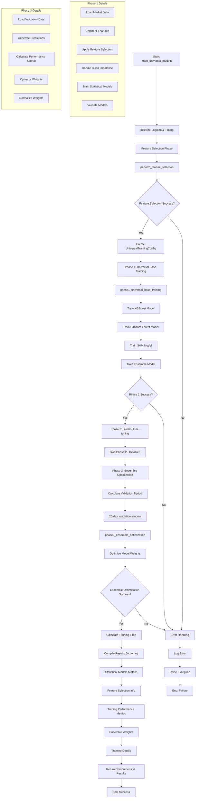

# `train_universal_models` Method Comprehensive Breakdown

## Overview

The `train_universal_models` method is the core orchestrator of a sophisticated 3-phase machine learning training pipeline designed for financial trading systems. This async method implements a universal training strategy that processes multiple trading symbols simultaneously, applies advanced feature selection, trains statistical models, and optimizes ensemble weights for robust trading predictions.

## 1. Detailed Step-by-Step Explanation

### Method Signature and Parameters

```python
async def train_universal_models(
    self,
    symbols: List[str],
    start_date: str,
    end_date: str,
    model_types: List[str] = None
) -> Dict[str, Any]
```

**Input Requirements:**
- `symbols`: List of trading symbols (e.g., ['AAPL', 'GOOGL', 'TSLA'])
- `start_date`: Training start date in 'YYYY-MM-DD' format
- `end_date`: Training end date in 'YYYY-MM-DD' format
- `model_types`: Optional list of specific model types to train

### Phase-by-Phase Breakdown

#### Initialization Phase
1. **Logging and Timing Setup**
   - Logs the start of training with symbol count
   - Records start time for performance tracking
   - Initializes error handling with try-catch block

#### Feature Selection Phase
2. **Feature Selection Execution**
   ```python
   await self.perform_feature_selection(
       symbols=symbols,
       start_date=start_date,
       end_date=end_date
   )
   ```
   - **Purpose**: Reduces dimensionality and selects most relevant features
   - **Method**: Uses `mutual_info_regression` algorithm
   - **Output**: Updates `self.selected_features` and `self.selected_feature_indices`
   - **Data Flow**: Processes 3D temporal data → applies aggregation → selects optimal features

#### Phase 1: Universal Base Model Training
3. **Configuration Setup**
   ```python
   config = UniversalTrainingConfig(
       symbols=symbols,
       start_date=start_date,
       end_date=end_date,
       enable_smote=self.config.enable_imbalance_mitigation,
       force_2d_for_statistical=True
   )
   ```
   - **Purpose**: Creates training configuration for statistical models
   - **Key Setting**: `force_2d_for_statistical=True` ensures 2D data pipeline

4. **Statistical Model Training**
   ```python
   phase1_results = await self.phase1_universal_base_training(
       data_loader=self.data_pipeline,
       config=config
   )
   ```
   - **Models Trained**: XGBoost, Random Forest, SVM, Ensemble
   - **Data Processing**: Uses 2D aggregated features from temporal data
   - **Class Imbalance**: Applies SMOTE if enabled
   - **Output**: Training metrics, model configurations, feature importance

#### Phase 2: Symbol-Specific Fine-tuning (Currently Disabled)
5. **Fine-tuning Phase**
   ```python
   # Phase 2: Symbol-specific fine-tuning (DISABLED)
   phase2_results = {}
   ```
   - **Status**: Intentionally disabled to eliminate dependencies
   - **Purpose**: Would customize models for individual symbols
   - **Current Implementation**: Returns empty results

#### Phase 3: Ensemble Optimization
6. **Validation Period Calculation**
   ```python
   end_dt = datetime.strptime(end_date, '%Y-%m-%d')
   validation_start_dt = end_dt - timedelta(days=20)
   validation_end_dt = end_dt
   ```
   - **Window**: 20-day validation period for day trading optimization
   - **Purpose**: Recent data focus for capturing current market patterns

7. **Ensemble Weight Optimization**
   ```python
   ensemble_weights = await self.phase3_ensemble_optimization(
       symbols=symbols,
       validation_start=validation_start,
       validation_end=validation_end
   )
   ```
   - **Method**: Performance-based weight calculation
   - **Output**: Optimized weights for model combination
   - **Validation**: Uses recent market data for weight determination

#### Results Compilation Phase
8. **Comprehensive Results Assembly**
   - **Training Metrics**: Accuracy, loss, consistency measures
   - **Feature Information**: Selection counts, methods, indices
   - **Model Details**: Configurations, performance, readiness status
   - **Trading Metrics**: Prediction readiness, ensemble availability
   - **Timing Information**: Total training time calculation

### Output Format

The method returns a comprehensive dictionary with the following structure:

```python
{
    'training_completed': bool,
    'total_training_time': float,
    'symbols_trained': List[str],
    'training_date_range': {'start': str, 'end': str},
    'statistical_models': {
        'models_trained': List[str],
        'validation_metrics': Dict[str, Dict[str, float]],
        'model_configs': Dict[str, Any],
        'feature_importance': Dict[str, Any]
    },
    'feature_selection': {
        'selected_feature_count': int,
        'feature_selection_method': str,
        'expected_unique_features': int
    },
    'trading_performance': {
        'avg_model_accuracy': float,
        'best_performing_model': str,
        'model_consistency': Dict[str, float],
        'prediction_readiness': Dict[str, Any]
    },
    'ensemble_optimization': {
        'weights': Dict[str, float],
        'validation_period_days': int,
        'optimization_completed': bool
    }
}
```

## 2. Visual Flowchart



## 3. Code Structure

### Module Organization

```
backend/ml/
├── universal_trainer.py          # Main training orchestrator
├── feature_selector.py           # Feature selection algorithms
├── universal_feature_engineering.py  # Feature engineering pipeline
├── model_types.py               # Model type definitions
├── class_imbalance_mitigation.py    # SMOTE and class balancing
├── temporal_aggregator.py       # Time series aggregation
└── universal_model_architectures.py # Model implementations
```

### Key Function Definitions

#### Core Training Functions
```python
# Main orchestrator
async def train_universal_models(self, symbols, start_date, end_date, model_types=None)

# Feature selection
async def perform_feature_selection(self, symbols, start_date, end_date, config=None)

# Phase 1: Base model training
async def phase1_universal_base_training(self, data_loader, config)

# Phase 3: Ensemble optimization
async def phase3_ensemble_optimization(self, symbols, validation_start, validation_end)
```

#### Supporting Functions
```python
# Feature processing
def _combine_features_from_featureset(self, feature_set)
def _calculate_expected_unique_features(self)
def prepare_3d_for_feature_selection(self, features_3d)

# Model management
async def save_universal_models(self, save_dir)
def get_imbalance_metrics(self)
```

### Critical Algorithms Implemented

#### 1. Feature Selection Algorithm
- **Method**: Mutual Information Regression
- **Purpose**: Identifies most predictive features
- **Implementation**: Handles 3D→2D temporal aggregation

#### 2. Class Imbalance Mitigation
- **SMOTE**: Synthetic Minority Oversampling Technique
- **Class Weights**: Balanced weight calculation
- **Integration**: Applied during model training

#### 3. Ensemble Optimization
- **Weight Calculation**: Performance-based scoring
- **Validation**: Recent market data validation
- **Normalization**: Ensures weights sum to 1.0

#### 4. Temporal Aggregation
- **Input**: 3D time series data (samples, timesteps, features)
- **Output**: 2D aggregated features (samples, aggregated_features)
- **Methods**: Min, max, mean, std aggregations

## 4. Dependencies

### Required Libraries/Packages

#### Core ML Libraries
```python
import numpy as np
import pandas as pd
from sklearn.ensemble import RandomForestClassifier
from sklearn.svm import SVC
import xgboost as xgb
from sklearn.feature_selection import mutual_info_regression
from imblearn.over_sampling import SMOTE
```

#### Async and Utilities
```python
import asyncio
from datetime import datetime, timedelta
from typing import List, Dict, Any, Optional
from dataclasses import dataclass
import logging
from pathlib import Path
import joblib
```

### External Service Integrations

#### Data Pipeline Integration
- **Service**: `DataPipeline` class
- **Purpose**: Market data loading and preprocessing
- **Methods**: `load_market_data()`, data validation

#### Feature Engineering Integration
- **Service**: `UniversalFeatureEngineering`
- **Purpose**: Technical indicator calculation
- **Methods**: `engineer_features()`, feature combination

#### Model Architecture Integration
- **Service**: `UniversalModelArchitectures`
- **Purpose**: Model creation and management
- **Methods**: Statistical model instantiation, saving/loading

### Configuration Requirements

#### UniversalTrainingConfig Parameters
```python
@dataclass
class UniversalTrainingConfig:
    # Training windows
    base_training_window: int = 12      # months
    base_validation_window: int = 3     # months
    base_lookback_window: int = 30      # minutes
    base_validation_split: float = 0.2
    
    # Model-specific parameters
    xgboost_n_estimators: int = 1000
    xgboost_max_depth: int = 7
    xgboost_learning_rate: float = 0.15
    
    rf_n_estimators: int = 500
    rf_max_depth: int = 12
    
    svm_kernel: str = 'rbf'
    svm_C: float = 1.0
    
    # Trading parameters
    prediction_threshold: float = 0.55
    take_profit_pct: float = 0.003
    stop_loss_pct: float = 0.001
    
    # System settings
    enable_imbalance_mitigation: bool = True
    enable_temporal_aggregation: bool = True
    random_state: int = 42
    n_jobs: int = -1
```

#### Feature Selection Configuration
```python
@dataclass
class FeatureSelectionConfig:
    method: str = 'mutual_info_regression'
    n_features: int = 65
    validation_split: float = 0.2
    random_state: int = 42
```

#### Class Imbalance Configuration
```python
@dataclass
class ImbalanceConfig:
    enable_smote: bool = True
    smote_sampling_strategy: str = 'auto'
    smote_k_neighbors: int = 5
    enable_class_weights: bool = True
    class_weight_method: str = 'balanced'
```

### Environment Requirements

#### System Dependencies
- **Python**: 3.8+
- **Memory**: Minimum 8GB RAM for multi-symbol training
- **Storage**: Sufficient space for model artifacts and data
- **CPU**: Multi-core recommended (n_jobs=-1 utilizes all cores)

#### Database Requirements
- **Market Data Storage**: PostgreSQL or similar for historical data
- **Model Storage**: File system for model artifacts
- **Logging**: Structured logging system for training monitoring

## Performance Characteristics

### Training Time Expectations
- **Single Symbol**: 2-5 minutes
- **Multiple Symbols (5-10)**: 10-30 minutes
- **Large Scale (50+ symbols)**: 1-3 hours

### Memory Usage
- **Feature Engineering**: ~1-2GB per symbol
- **Model Training**: ~500MB-1GB per model
- **Peak Usage**: ~4-8GB for typical workloads

### Scalability Considerations
- **Horizontal**: Can process symbols in batches
- **Vertical**: Utilizes multi-core processing
- **Memory Management**: Implements data streaming for large datasets

## Error Handling and Monitoring

### Exception Management
- **Comprehensive Logging**: All phases logged with timestamps
- **Graceful Degradation**: Continues training if individual models fail
- **Error Propagation**: Critical failures bubble up with context

### Monitoring Metrics
- **Training Progress**: Phase completion status
- **Model Performance**: Accuracy, loss, consistency metrics
- **Resource Usage**: Memory, CPU, training time
- **Data Quality**: Feature counts, class balance, validation scores

This comprehensive breakdown provides a complete understanding of the `train_universal_models` method's architecture, workflow, and implementation details for effective utilization in trading system development.